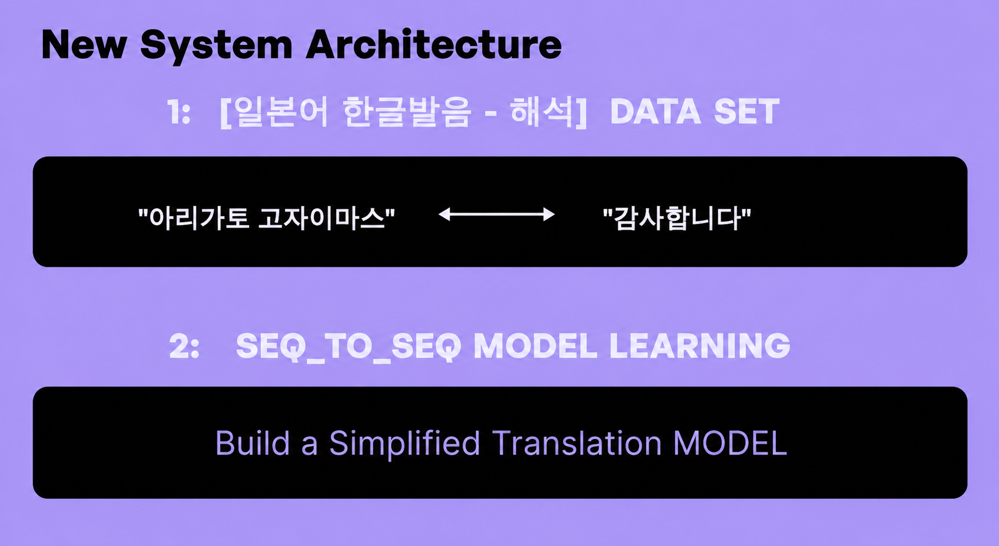
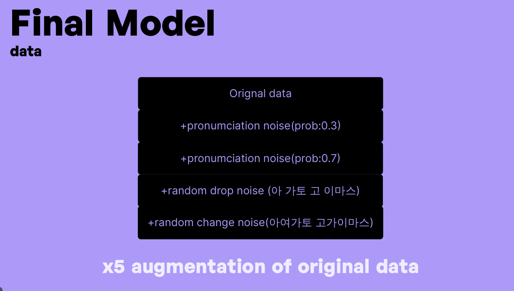
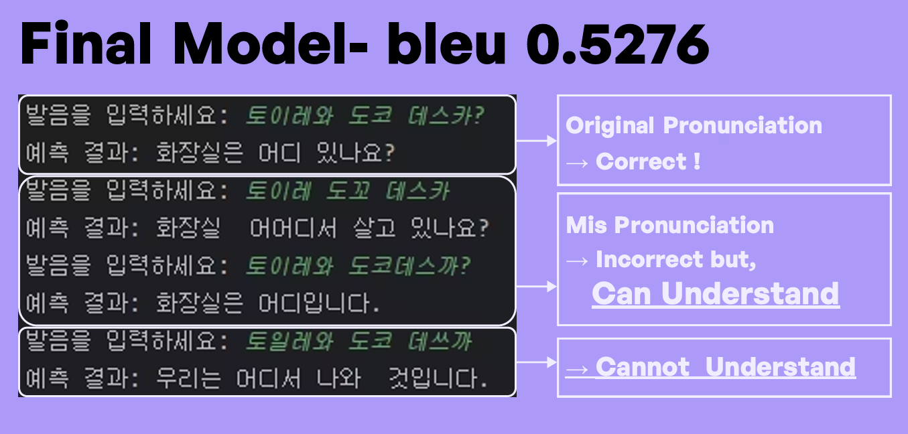

# PhonoTrans

**Japanese Pronunciation-based Translation with Seq2Seq + Attention**

PhonoTrans is a Japanese translation system designed for users unfamiliar with Japanese. Users can type Japanese speech phonetically in Hangul as they hear it, and the system interprets the intended Japanese expression and directly provides its Korean meaning.

Instead of requiring Japanese text as an intermediate representation, the final system learns an end-to-end mapping:

> **Hangul pronunciation → Korean meaning**

## Project Overview

- **Period:** 2025
- **Task:** Sequence-to-sequence translation
- **Input:** Japanese pronunciation written in Hangul
- **Output:** Korean sentence
- **Model:** Character-level Seq2Seq with GRU encoder-decoder and Attention
- **Framework:** PyTorch
- **Evaluation:** BLEU

## Motivation

The project was motivated by a practical problem: users who do not know Japanese may hear a Japanese expression but be unable to identify or type the original Japanese text. PhonoTrans allows them to enter the pronunciation as they hear it using Hangul and receive the corresponding Korean meaning.

The initial approach used a multi-stage pipeline:

`Hangul pronunciation → Romanization → Japanese text → Korean translation`


This structure was vulnerable to error propagation: mistakes produced by one stage became input errors for the next stage. The project therefore moved to a direct end-to-end architecture that predicts Korean meaning from Hangul pronunciation.



## Dataset

The project combined a general Japanese corpus with dialogue-focused data.

| Data source | Size |
| --- | ---: |
| General Japanese corpus | 203,821 sentences |
| Dialogue / conversational corpus | 41,736 sentences |
| Combined scale | approximately 245K sentence pairs |

Japanese sentences were converted into training pairs containing Hangul pronunciation and Korean meaning. For the dialogue corpus, the recovered project code extracts utterances from dialogue JSON and collects Papago's displayed pronunciation and Korean translation through Selenium.

Recovered project scripts show two related split workflows used during development: an earlier **80/10/10 train/validation/test split with random state 42**, and a later augmentation workflow that first fixed **10% as test data**, saved the remaining 90% as `dataset_except_test.csv`, then augmented and re-split that train/validation pool.

Because the full dataset is large and includes externally collected/translated material, this repository contains only a **small sample** rather than the complete training corpus.

## Model Architecture

The final model is a character-level Seq2Seq architecture:

1. **Encoder**
   - Character embedding
   - GRU encoder

2. **Attention**
   - Computes attention weights over encoder outputs at each decoding step

3. **Decoder**
   - Character embedding
   - Attention context
   - GRU decoder
   - Linear output layer

The implementation uses teacher forcing during training, greedy token selection during validation/evaluation, and autoregressive greedy decoding during interactive inference.

## Data Augmentation Experiments

Several pronunciation-noise strengths were compared during development.

| Augmentation setting | Recorded BLEU runs |
| --- | --- |
| 0.3 | 0.5430, 0.2836, 0.5260, **0.5608** |
| 0.5 | 0.5260, 0.5468 |
| 1.0 | 0.4889, 0.5564, 0.5357 |

To address overfitting, later experiments combined:

- pronunciation augmentation at **0.3 and 0.7**
- dropout-style noise: **0.2**
- random Hangul substitution: **0.2**
- approximately **5× augmentation**



This configuration produced recorded BLEU runs of **0.5276** and **0.5523**.

The configuration used in the final presentation reported **BLEU 0.5276**. The highest recorded experimental run in the project log was approximately **0.56**.

The repository includes recovered preprocessing utilities from the original project for phonological-process noise, vowel noise, dataset splitting, and train/validation augmentation. These utilities document the verified parts of the original data pipeline; the later combined x5 augmentation experiments are preserved as recorded experimental results rather than claimed as fully reproduced by the public preprocessing script.

## Final Result

The final presentation model reported **BLEU 0.5276**. In qualitative inference tests, the model correctly handled the original pronunciation and could preserve the intended meaning for some noisy pronunciation variants, while stronger distortions could still produce unrelated outputs.



## Repository Structure

```text
phonotrans/
├── README.md
├── requirements.txt
├── .gitignore
├── docs/
│   └── images/
│       ├── original_architecture.png
│       ├── new_architecture.png
│       ├── final_model_data.png
│       └── final_model_result.png
├── data/
│   └── sample.csv
├── data_collection/
│   └── dialogue_papago.py
├── preprocessing/
│   ├── pronunciation_converter.py
│   ├── split_dataset.py
│   ├── noise_generator.py
│   └── augmentation.py
├── experiments/
│   └── initial_pipeline/
│       ├── hangul_to_romanization.py
│       ├── romaji_to_hiragana.py
│       ├── jp_to_ko_mbart.py
│       └── pipeline_demo.py
└── src/
    ├── config.py
    ├── data.py
    ├── model_factory.py
    ├── seq2seq.py
    ├── utils.py
    ├── train.py
    ├── eval.py
    └── infer.py
```

### Code Organization

- `data_collection/` contains recovered data acquisition utilities.
- `preprocessing/` contains dataset splitting, pronunciation conversion, and verified augmentation utilities.
- `experiments/initial_pipeline/` preserves the earlier staged translation approach for project history.
- `src/config.py` centralizes model, training, path, and runtime settings shared by training, evaluation, and inference.
- `src/data.py` centralizes CSV pair loading and padded batch collation.
- `src/model_factory.py` provides one shared constructor for the Seq2Seq + Attention architecture so `train.py`, `eval.py`, and `infer.py` use the same model definition.
- `src/seq2seq.py` contains the Encoder, Attention, AttentionDecoder, and Seq2Seq modules.
- `src/utils.py` contains the character vocabulary and PyTorch dataset implementation.

`data_collection/dialogue_papago.py` is a cleaned version of the recovered dialogue-data collection script. It extracts utterances from the Japanese dialogue JSON format and records Papago pronunciation and Korean translation. The selectors reflect the web interface used during the original project and may need adjustment if the service UI changes.

`preprocessing/split_dataset.py` preserves the recovered project's 80/10/10 split procedure with `random_state=42`, while removing machine-specific Windows paths.

`preprocessing/pronunciation_converter.py` is an auxiliary preprocessing utility that converts Japanese text into a Hangul pronunciation representation through romanization.

`preprocessing/noise_generator.py` contains the recovered Korean phonological-process and vowel-noise functions used by the project augmentation script. `preprocessing/augmentation.py` applies the two noise functions, merges original and augmented rows, shuffles the data, and performs the train/validation split after test data has already been excluded.

`experiments/initial_pipeline/` preserves the earlier multi-stage approach used during development: Hangul pronunciation → romanization → Japanese representation → Korean translation. It is included to document the transition from the error-prone staged pipeline to the final direct Seq2Seq architecture.

## Example

```text
Input : 혼와 도코데 카에마스카
Target: 책은 어디서 살 수 있나요?
```

## Data Preparation

To reproduce the recovered original 80/10/10 split from a prepared full dataset:

```bash
python preprocessing/split_dataset.py \
  --input data/final_converted_input_target.csv \
  --output-dir data
```

For the recovered 0.3 dual-noise preprocessing flow used after a fixed test set had already been excluded:

```bash
python preprocessing/augmentation.py \
  --input data/dataset_except_test.csv \
  --prob 0.3 \
  --output-dir data
```

## Training

Place prepared `train.csv`, `val.csv`, and `test.csv` files under a local `data/` directory with the following columns:

```text
input,target
```

The canonical configuration is defined in `src/config.py` and follows the final presentation setup: batch size **64**, validation batch size **16**, embedding dimension **128**, hidden dimension **256**, up to **30 epochs**, learning rate **0.001**, teacher forcing ratio **0.6**, early-stopping patience **5**, and weight decay **0.0001**.

Training:

```bash
python src/train.py
```

Evaluation:

```bash
python src/eval.py
```

Interactive inference:

```bash
python src/infer.py
```

> The original project scripts were developed in a local project environment. Recovered scripts in this repository have been cleaned to remove machine-specific absolute paths.

## Notes

- Large datasets and trained checkpoints are intentionally excluded from the public repository.
- The repository contains a compact sample dataset for illustrating the expected input/target format.
- Evaluation uses the mean of character-level sentence BLEU scores.
- The verified recovered public augmentation code reproduces the 0.3 dual-noise flow, but not the later full x5 augmentation recipe.
- `faster_train.py` from the recovered project used validation-loss early stopping with a different experimental configuration, so it is not used as the canonical final-presentation training script.

## Tech Stack

`Python` `PyTorch` `Pandas` `NLTK` `scikit-learn` `Selenium` `Seq2Seq` `GRU` `Attention` `NLP` `Data Augmentation`
