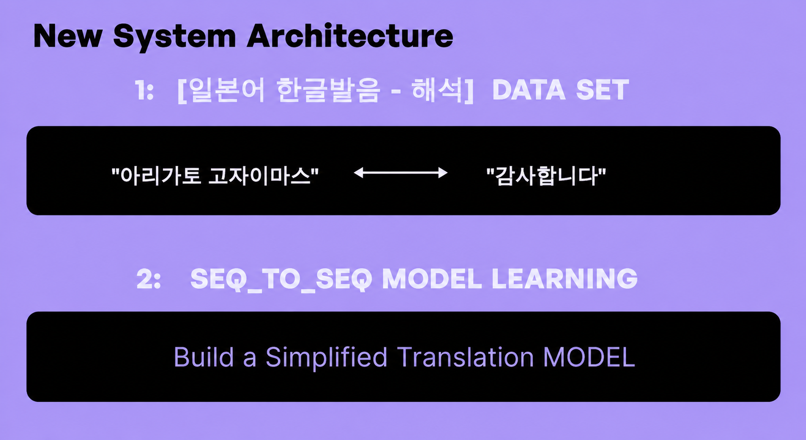
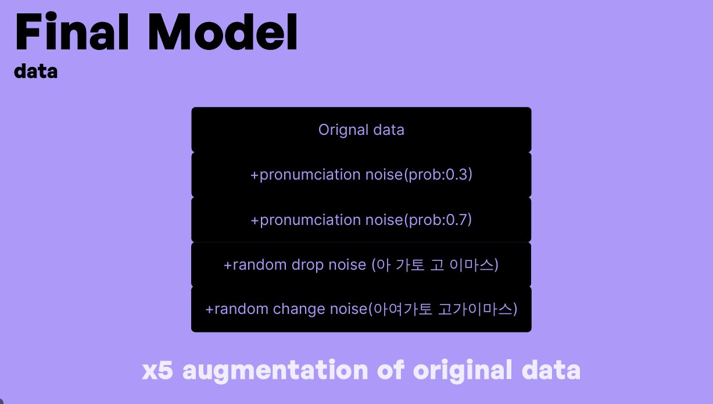
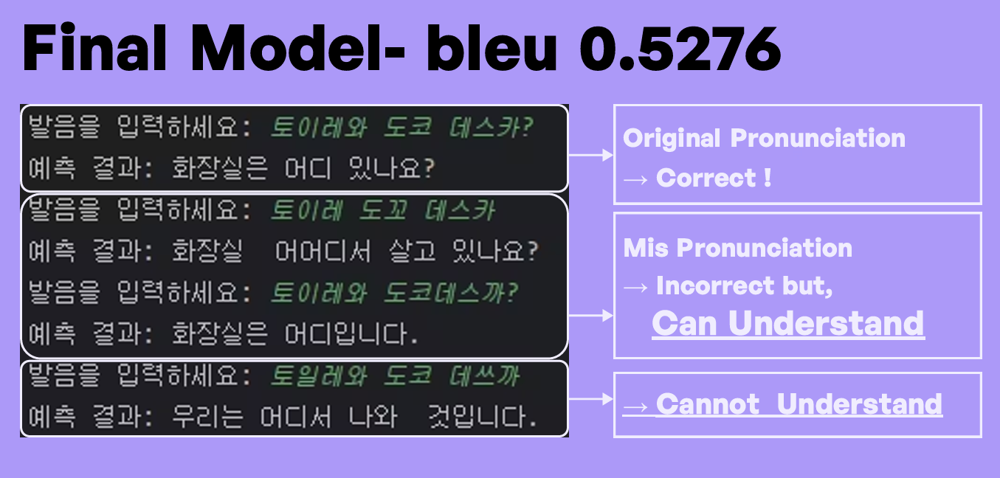

# PhonoTrans | Japanese Pronunciation-Based Translator

**Character-level Seq2Seq with GRU and Attention · 2025**

[Portfolio](https://incredible-march-0ef.notion.site/14d68564df5a82179efc017502741a9b)

PhonoTrans is a Japanese translation system for users unfamiliar with Japanese. Users type Japanese speech phonetically in Hangul, and the model directly predicts the corresponding Korean meaning.

> **Hangul pronunciation → Korean meaning**

**Final presentation result:** BLEU **0.5276** (reported project result; the original checkpoint is not included).

## Project Overview

- **Period:** 2025
- **Task:** Sequence-to-sequence translation
- **Input:** Japanese pronunciation written in Hangul
- **Output:** Korean sentence
- **Model:** Character-level Seq2Seq with GRU encoder-decoder and Attention
- **Framework:** PyTorch
- **Evaluation:** BLEU

## Motivation

Users who do not know Japanese may hear an expression but be unable to identify or type the original Japanese text. PhonoTrans was designed to accept the pronunciation as heard in Hangul and return the corresponding Korean meaning.

The initial approach used a multi-stage pipeline:

`Hangul pronunciation → Romanization → Japanese text → Korean translation`


Because errors from one stage propagated into the next, the system was redesigned as a direct end-to-end mapping from Hangul pronunciation to Korean meaning.



## Dataset

The project combined a general Japanese corpus with dialogue-focused data.

| Data source | Size |
| --- | ---: |
| General Japanese corpus | 203,821 sentences |
| Dialogue / conversational corpus | 41,736 sentences |
| Combined scale | approximately 245K sentence pairs |

Japanese sentences were converted into training pairs containing Hangul pronunciation and Korean meaning. For the dialogue corpus, the recovered project code extracts utterances from dialogue JSON and collects Papago pronunciation and Korean translation through Selenium.

Recovered scripts show two split workflows used during development: an earlier **80/10/10 train/validation/test split with random state 42**, and a later augmentation workflow that first fixed **10% as test data**, saved the remaining 90% as `dataset_except_test.csv`, then augmented and re-split the train/validation pool.

Because the full dataset is large and includes externally collected and translated material, this repository contains only a small sample rather than the complete training corpus.

## Model Architecture

The final model is a character-level Seq2Seq architecture with three main components:

1. **Encoder** — character embedding + GRU
2. **Attention** — computes attention weights over encoder outputs at each decoding step
3. **Decoder** — character embedding + attention context + GRU + linear output layer

Training uses teacher forcing, validation/evaluation uses greedy token selection, and interactive inference uses autoregressive greedy decoding.

## Data Augmentation Experiments

The project compared pronunciation-noise strengths **0.3, 0.5, 0.7, and 1.0**, as well as random Hangul substitution and random drop at **0.2**.

The final presentation setup combined pronunciation noise at **0.3 and 0.7** with substitution and drop, expanding the training data approximately **fivefold**.



Some experimental runs reached BLEU around **0.56**; the final presentation reported **0.5276**. These recorded runs should not be treated as a controlled comparison without their complete split and evaluation settings.

The public preprocessing code contains phonological-process noise, vowel noise, dataset splitting, and the recovered **0.3 dual-noise** workflow. The complete later fivefold augmentation recipe remains documented in project records and cannot be reproduced from these utilities alone.

## Final Result

The final presentation model reported **BLEU 0.5276**. Qualitative inference examples showed correct output for the original pronunciation and partial tolerance to some pronunciation variations, while stronger distortions could still lead to unrelated predictions.



## Repository Structure

```text
phonotrans/
├── README.md
├── requirements.txt
├── .gitignore
├── docs/
│   └── images/
│       ├── original_architecture.png
│       ├── new_architecture.png
│       ├── final_model_data.png
│       └── final_model_result.png
├── data/
│   └── sample.csv
├── data_collection/
│   └── dialogue_papago.py
├── preprocessing/
│   ├── pronunciation_converter.py
│   ├── split_dataset.py
│   ├── noise_generator.py
│   └── augmentation.py
├── experiments/
│   └── initial_pipeline/
│       ├── hangul_to_romanization.py
│       ├── romaji_to_hiragana.py
│       ├── jp_to_ko_mbart.py
│       └── pipeline_demo.py
└── src/
    ├── config.py
    ├── data.py
    ├── model_factory.py
    ├── seq2seq.py
    ├── utils.py
    ├── train.py
    ├── eval.py
    └── infer.py
```

### Code Organization

- `data_collection/` — data acquisition utilities
- `preprocessing/` — dataset splitting, pronunciation conversion, and verified augmentation utilities
- `experiments/initial_pipeline/` — earlier staged translation pipeline
- `src/config.py` — shared model, training, path, and runtime settings
- `src/data.py` — CSV pair loading and padded batch collation
- `src/model_factory.py` — shared Seq2Seq + Attention model constructor
- `src/seq2seq.py` — Encoder, Attention, AttentionDecoder, and Seq2Seq modules
- `src/utils.py` — character vocabulary and PyTorch dataset implementation

## Example

```text
Input : 혼와 도코데 카에마스카
Target: 책은 어디서 살 수 있나요?
```

## Installation

Run the commands from the repository root in a Python environment with a compatible PyTorch installation.

```bash
pip install -r requirements.txt
```

The small `data/sample.csv` file illustrates the input format. It does not replace the full training corpus or the prepared train/validation/test files.

## Data Preparation

To reproduce the recovered original 80/10/10 split:

```bash
python preprocessing/split_dataset.py \
  --input data/final_converted_input_target.csv \
  --output-dir data
```

For the recovered 0.3 dual-noise preprocessing flow after the fixed test set has already been excluded:

```bash
python preprocessing/augmentation.py \
  --input data/dataset_except_test.csv \
  --prob 0.3 \
  --output-dir data
```

## Training

Place prepared `train.csv`, `val.csv`, and `test.csv` files under `data/` with the following columns:

```text
input,target
```

The canonical configuration in `src/config.py` follows the final presentation setup: batch size **64**, validation batch size **16**, embedding dimension **128**, hidden dimension **256**, up to **30 epochs**, learning rate **0.001**, teacher forcing ratio **0.6**, early-stopping patience **5**, and weight decay **0.0001**.

Training:

```bash
python src/train.py
```

Evaluation:

```bash
python src/eval.py
```

Evaluation and inference require the model checkpoint and character vocabularies generated by training under `runs/`; these artifacts are not provided in the public repository.

Interactive inference:

```bash
python src/infer.py
```

## Evaluation & Limitations

- Evaluation reports the **mean of character-level sentence BLEU scores**, using NLTK smoothing method 1. It is not a corpus-level word-tokenized BLEU score.
- The evaluation script decodes for the reference target's length, whereas interactive inference stops at EOS or 100 generated characters. Their decoding conditions differ.
- The recovered augmentation utility merges original and augmented rows before splitting train/validation data. Variants of the same source sentence may therefore appear in both sets, which can make validation optimistic. Future experiments should split source examples before augmenting the training set.
- The full corpus, original final checkpoint, and complete fivefold augmentation recipe are absent, so the reported **0.5276** is a historical project result rather than a score reproduced by this public repository.
- Strong pronunciation distortions can produce unrelated translations. Evaluation on realistic user transcriptions remains future work.

## Review

The main development was identifying error propagation in the initial multi-stage pipeline and reframing translation as a direct Hangul-pronunciation-to-Korean Seq2Seq task. Pronunciation augmentation experiments then explored robustness to imperfect transcriptions.

## Notes

- Large datasets and trained checkpoints are excluded from the public repository.
- The repository includes a compact sample dataset showing the expected input/target format.
- The verified public augmentation code reproduces the recovered 0.3 dual-noise flow, but not the later full x5 augmentation recipe.

## Tech Stack

`Python` `PyTorch` `Pandas` `NLTK` `scikit-learn` `Selenium` `Seq2Seq` `GRU` `Attention` `NLP` `Data Augmentation`
